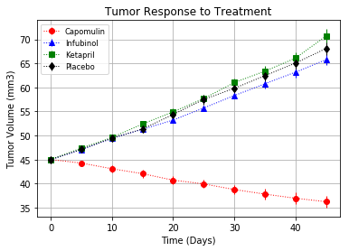
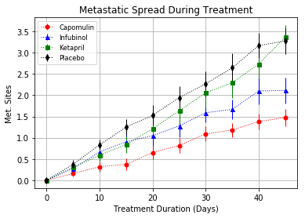
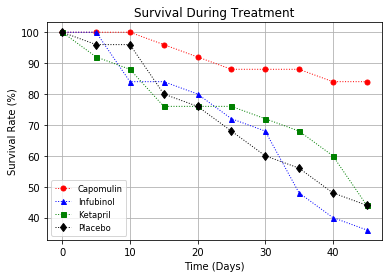
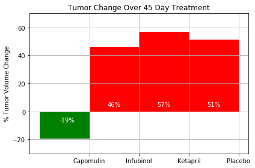

```python
# Dependencies and Setup
%matplotlib inline

import matplotlib.pyplot as plt
import pandas as pd
import numpy as np
from scipy.stats import sem
# Hide warning messages in notebook
import warnings
warnings.filterwarnings('ignore')

# File to Load (Remember to Change These)
mouse_drug_data_to_load = "data/mouse_drug_data.csv"
clinical_trial_data_to_load = "data/clinicaltrial_data.csv"

# Read the Mouse and Drug Data and the Clinical Trial Data
clinical_data = pd.read_csv(clinical_trial_data_to_load)
mouse_data = pd.read_csv(mouse_drug_data_to_load)
# Combine the data into a single dataset
merged_data = pd.merge(mouse_data, clinical_data, on="Mouse ID")

```


```python

```


```python
nMerged_data = merged_data[['Mouse ID', 'Timepoint', 'Tumor Volume (mm3)', 'Metastatic Sites', 'Drug']]
nMerged_data.head()
```


<div>
<style scoped>
    .dataframe tbody tr th:only-of-type {
        vertical-align: middle;
    }

    .dataframe tbody tr th {
        vertical-align: top;
    }

    .dataframe thead th {
        text-align: right;
    }
</style>
<table border="1" class="dataframe">
  <thead>
    <tr style="text-align: right;">
      <th></th>
      <th>Mouse ID</th>
      <th>Timepoint</th>
      <th>Tumor Volume (mm3)</th>
      <th>Metastatic Sites</th>
      <th>Drug</th>
    </tr>
  </thead>
  <tbody>
    <tr>
      <th>0</th>
      <td>f234</td>
      <td>0</td>
      <td>45.000000</td>
      <td>0</td>
      <td>Stelasyn</td>
    </tr>
    <tr>
      <th>1</th>
      <td>f234</td>
      <td>5</td>
      <td>47.313491</td>
      <td>0</td>
      <td>Stelasyn</td>
    </tr>
    <tr>
      <th>2</th>
      <td>f234</td>
      <td>10</td>
      <td>47.904324</td>
      <td>0</td>
      <td>Stelasyn</td>
    </tr>
    <tr>
      <th>3</th>
      <td>f234</td>
      <td>15</td>
      <td>48.735197</td>
      <td>1</td>
      <td>Stelasyn</td>
    </tr>
    <tr>
      <th>4</th>
      <td>f234</td>
      <td>20</td>
      <td>51.112713</td>
      <td>2</td>
      <td>Stelasyn</td>
    </tr>
  </tbody>
</table>
</div>


```python

```


```python
#--------------------------------------------------------------------------------------------------------------------------------------
#Tumor Response to Treatment:
#--------------------------------------------------------------------------------------------------------------------------------------
# Store the Mean Tumor Volume Data Grouped by Drug and Timepoint 
# Convert to DataFrame
# Preview DataFrame
#--------------------------------------------------------------------------------------------------------------------------------------
#sort data frame by drug and timepoint 
D_T_group_df = nMerged_data.groupby(['Drug', 'Timepoint'])
#create a grouped mean volume series using mean() function
grouped_mean_vol = D_T_group_df['Tumor Volume (mm3)'].mean()
#convert the mean volumne series data into a data frame
grouped_mean_vol_df = pd.DataFrame(grouped_mean_vol)
#reset index to display data in apporpriate format 
grouped_mean_vol_df = grouped_mean_vol_df.reset_index()
grouped_mean_vol_df.head()
```


<div>
<style scoped>
    .dataframe tbody tr th:only-of-type {
        vertical-align: middle;
    }

    .dataframe tbody tr th {
        vertical-align: top;
    }

    .dataframe thead th {
        text-align: right;
    }
</style>
<table border="1" class="dataframe">
  <thead>
    <tr style="text-align: right;">
      <th></th>
      <th>Drug</th>
      <th>Timepoint</th>
      <th>Tumor Volume (mm3)</th>
    </tr>
  </thead>
  <tbody>
    <tr>
      <th>0</th>
      <td>Capomulin</td>
      <td>0</td>
      <td>45.000000</td>
    </tr>
    <tr>
      <th>1</th>
      <td>Capomulin</td>
      <td>5</td>
      <td>44.266086</td>
    </tr>
    <tr>
      <th>2</th>
      <td>Capomulin</td>
      <td>10</td>
      <td>43.084291</td>
    </tr>
    <tr>
      <th>3</th>
      <td>Capomulin</td>
      <td>15</td>
      <td>42.064317</td>
    </tr>
    <tr>
      <th>4</th>
      <td>Capomulin</td>
      <td>20</td>
      <td>40.716325</td>
    </tr>
  </tbody>
</table>
</div>


```python

```


```python
#--------------------------------------------------------------------------------------------------------------------------------------
# Store the Standard Error of Tumor Volumes Grouped by Drug and Timepoint
# Convert to DataFrame
# Preview DataFrame
#--------------------------------------------------------------------------------------------------------------------------------------
#use sem() function on tumor volume of the grouped data frame 
standard_vol_error = D_T_group_df['Tumor Volume (mm3)'].sem()
#create a data frame using the standard error series
standard_vol_error_df = pd.DataFrame(standard_vol_error)
#reset to acquire desired format
standard_vol_error_df = standard_vol_error_df.reset_index()
standard_vol_error_df.head()
```


<div>
<style scoped>
    .dataframe tbody tr th:only-of-type {
        vertical-align: middle;
    }

    .dataframe tbody tr th {
        vertical-align: top;
    }

    .dataframe thead th {
        text-align: right;
    }
</style>
<table border="1" class="dataframe">
  <thead>
    <tr style="text-align: right;">
      <th></th>
      <th>Drug</th>
      <th>Timepoint</th>
      <th>Tumor Volume (mm3)</th>
    </tr>
  </thead>
  <tbody>
    <tr>
      <th>0</th>
      <td>Capomulin</td>
      <td>0</td>
      <td>0.000000</td>
    </tr>
    <tr>
      <th>1</th>
      <td>Capomulin</td>
      <td>5</td>
      <td>0.448593</td>
    </tr>
    <tr>
      <th>2</th>
      <td>Capomulin</td>
      <td>10</td>
      <td>0.702684</td>
    </tr>
    <tr>
      <th>3</th>
      <td>Capomulin</td>
      <td>15</td>
      <td>0.838617</td>
    </tr>
    <tr>
      <th>4</th>
      <td>Capomulin</td>
      <td>20</td>
      <td>0.909731</td>
    </tr>
  </tbody>
</table>
</div>


```python

```


```python
#--------------------------------------------------------------------------------------------------------------------------------------
# Minor Data Munging to Re-Format the Data Frames
# Preview that Reformatting worked
#--------------------------------------------------------------------------------------------------------------------------------------
#use pivot method on standard_vol_error_df to obtain a data frame grouped by "Timepoint", with columns as drugs, and values as volume error
vol_err_by_Drug = standard_vol_error_df.pivot(index="Timepoint", columns="Drug", values="Tumor Volume (mm3)")
vol_err_by_Drug.head()
#--------------------------------------------------------------------------------------------------------------------------------------
#use pivot method on group_mean_vol_df to obtain a data frame grouped by "Timepoint", with columns as drugs, and values as volume
vol_by_drug = grouped_mean_vol_df.pivot(index="Timepoint", columns="Drug", values="Tumor Volume (mm3)")
vol_by_drug.head()
```


<div>
<style scoped>
    .dataframe tbody tr th:only-of-type {
        vertical-align: middle;
    }

    .dataframe tbody tr th {
        vertical-align: top;
    }

    .dataframe thead th {
        text-align: right;
    }
</style>
<table border="1" class="dataframe">
  <thead>
    <tr style="text-align: right;">
      <th>Drug</th>
      <th>Capomulin</th>
      <th>Ceftamin</th>
      <th>Infubinol</th>
      <th>Ketapril</th>
      <th>Naftisol</th>
      <th>Placebo</th>
      <th>Propriva</th>
      <th>Ramicane</th>
      <th>Stelasyn</th>
      <th>Zoniferol</th>
    </tr>
    <tr>
      <th>Timepoint</th>
      <th></th>
      <th></th>
      <th></th>
      <th></th>
      <th></th>
      <th></th>
      <th></th>
      <th></th>
      <th></th>
      <th></th>
    </tr>
  </thead>
  <tbody>
    <tr>
      <th>0</th>
      <td>45.000000</td>
      <td>45.000000</td>
      <td>45.000000</td>
      <td>45.000000</td>
      <td>45.000000</td>
      <td>45.000000</td>
      <td>45.000000</td>
      <td>45.000000</td>
      <td>45.000000</td>
      <td>45.000000</td>
    </tr>
    <tr>
      <th>5</th>
      <td>44.266086</td>
      <td>46.503051</td>
      <td>47.062001</td>
      <td>47.389175</td>
      <td>46.796098</td>
      <td>47.125589</td>
      <td>47.248967</td>
      <td>43.944859</td>
      <td>47.527452</td>
      <td>46.851818</td>
    </tr>
    <tr>
      <th>10</th>
      <td>43.084291</td>
      <td>48.285125</td>
      <td>49.403909</td>
      <td>49.582269</td>
      <td>48.694210</td>
      <td>49.423329</td>
      <td>49.101541</td>
      <td>42.531957</td>
      <td>49.463844</td>
      <td>48.689881</td>
    </tr>
    <tr>
      <th>15</th>
      <td>42.064317</td>
      <td>50.094055</td>
      <td>51.296397</td>
      <td>52.399974</td>
      <td>50.933018</td>
      <td>51.359742</td>
      <td>51.067318</td>
      <td>41.495061</td>
      <td>51.529409</td>
      <td>50.779059</td>
    </tr>
    <tr>
      <th>20</th>
      <td>40.716325</td>
      <td>52.157049</td>
      <td>53.197691</td>
      <td>54.920935</td>
      <td>53.644087</td>
      <td>54.364417</td>
      <td>53.346737</td>
      <td>40.238325</td>
      <td>54.067395</td>
      <td>53.170334</td>
    </tr>
  </tbody>
</table>
</div>


```python

```


```python
#--------------------------------------------------------------------------------------------------------------------------------------
# Generate the Plot (with Error Bars)
# Save the Figure
#--------------------------------------------------------------------------------------------------------------------------------------
#create an array of values from 0 to 45 with intervals of 5 
x_axis = np.arange(0, 50, 5)
#create line plots (of x_axis vs vol_by_drug for each drug) with errorbars based on corresponding vol_err_by_Drug
#add: linewidth, marker, ms(marker size), color, and label
plt.errorbar(x_axis, vol_by_drug['Capomulin'], yerr=vol_err_by_Drug['Capomulin'], linewidth=1, marker='o', ms=6, color='red', label= "Capomulin", linestyle=':')

plt.errorbar(x_axis, vol_by_drug['Infubinol'], yerr=vol_err_by_Drug['Infubinol'], linewidth=1, marker='^', ms=6, color='blue', label= "Infubinol", linestyle=':')

plt.errorbar(x_axis, vol_by_drug['Ketapril'], yerr=vol_err_by_Drug['Ketapril'], linewidth=1, marker='s', ms=6, color='green', label= "Ketapril", linestyle=':')

plt.errorbar(x_axis, vol_by_drug['Placebo'], yerr=vol_err_by_Drug['Placebo'], linewidth=1, marker='d', ms=6, color='black', label= "Placebo", linestyle=':')

plt.title("Tumor Response to Treatment")
plt.xlabel("Time (Days)")
plt.ylabel("Tumor Volume (mm3)")
plt.grid()


plt.legend(loc="best", fontsize="small", fancybox=True)

```


    <matplotlib.legend.Legend at 0x11bad2f11d0>





```python

```


```python
#--------------------------------------------------------------------------------------------------------------------------------------
# Metastatic Response to Treatment:
#--------------------------------------------------------------------------------------------------------------------------------------
# Store the Mean Met. Site Data Grouped by Drug and Timepoint 
# Convert to DataFrame
# Preview DataFrame
#--------------------------------------------------------------------------------------------------------------------------------------
grouped_mean_Met = D_T_group_df['Metastatic Sites'].mean()
grouped_mean_Met_df = pd.DataFrame(grouped_mean_Met)
grouped_mean_Met_df.head()
```


<div>
<style scoped>
    .dataframe tbody tr th:only-of-type {
        vertical-align: middle;
    }

    .dataframe tbody tr th {
        vertical-align: top;
    }

    .dataframe thead th {
        text-align: right;
    }
</style>
<table border="1" class="dataframe">
  <thead>
    <tr style="text-align: right;">
      <th></th>
      <th></th>
      <th>Metastatic Sites</th>
    </tr>
    <tr>
      <th>Drug</th>
      <th>Timepoint</th>
      <th></th>
    </tr>
  </thead>
  <tbody>
    <tr>
      <th rowspan="5" valign="top">Capomulin</th>
      <th>0</th>
      <td>0.000000</td>
    </tr>
    <tr>
      <th>5</th>
      <td>0.160000</td>
    </tr>
    <tr>
      <th>10</th>
      <td>0.320000</td>
    </tr>
    <tr>
      <th>15</th>
      <td>0.375000</td>
    </tr>
    <tr>
      <th>20</th>
      <td>0.652174</td>
    </tr>
  </tbody>
</table>
</div>


```python

```


```python
#--------------------------------------------------------------------------------------------------------------------------------------
# Store the Standard Error associated with Met. Sites Grouped by Drug and Timepoint 
# Convert to DataFrame
# Preview DataFrame
#--------------------------------------------------------------------------------------------------------------------------------------
standard_Met_error = D_T_group_df['Metastatic Sites'].sem()
standard_Met_error_df = pd.DataFrame(standard_Met_error)
standard_Met_error_df.head()
```


<div>
<style scoped>
    .dataframe tbody tr th:only-of-type {
        vertical-align: middle;
    }

    .dataframe tbody tr th {
        vertical-align: top;
    }

    .dataframe thead th {
        text-align: right;
    }
</style>
<table border="1" class="dataframe">
  <thead>
    <tr style="text-align: right;">
      <th></th>
      <th></th>
      <th>Metastatic Sites</th>
    </tr>
    <tr>
      <th>Drug</th>
      <th>Timepoint</th>
      <th></th>
    </tr>
  </thead>
  <tbody>
    <tr>
      <th rowspan="5" valign="top">Capomulin</th>
      <th>0</th>
      <td>0.000000</td>
    </tr>
    <tr>
      <th>5</th>
      <td>0.074833</td>
    </tr>
    <tr>
      <th>10</th>
      <td>0.125433</td>
    </tr>
    <tr>
      <th>15</th>
      <td>0.132048</td>
    </tr>
    <tr>
      <th>20</th>
      <td>0.161621</td>
    </tr>
  </tbody>
</table>
</div>


```python

```


```python
# Minor Data Munging to Re-Format the Data Frames
# Preview that Reformatting worked
#--------------------------------------------------------------------------------------------------------------------------------------
#create a data frame of standard error for metastatic values groupedby Timepoint.. with comlumns set to drug names
#this will provide us with an easy way to reference a series containing standard error for metastatic values grouped by timepoint
grouped_err_Met_rein = standard_Met_error_df.reset_index()
Met_err_by_Drug = grouped_err_Met_rein.pivot(index="Timepoint", columns="Drug", values="Metastatic Sites")
Met_err_by_Drug.head()
```


<div>
<style scoped>
    .dataframe tbody tr th:only-of-type {
        vertical-align: middle;
    }

    .dataframe tbody tr th {
        vertical-align: top;
    }

    .dataframe thead th {
        text-align: right;
    }
</style>
<table border="1" class="dataframe">
  <thead>
    <tr style="text-align: right;">
      <th>Drug</th>
      <th>Capomulin</th>
      <th>Ceftamin</th>
      <th>Infubinol</th>
      <th>Ketapril</th>
      <th>Naftisol</th>
      <th>Placebo</th>
      <th>Propriva</th>
      <th>Ramicane</th>
      <th>Stelasyn</th>
      <th>Zoniferol</th>
    </tr>
    <tr>
      <th>Timepoint</th>
      <th></th>
      <th></th>
      <th></th>
      <th></th>
      <th></th>
      <th></th>
      <th></th>
      <th></th>
      <th></th>
      <th></th>
    </tr>
  </thead>
  <tbody>
    <tr>
      <th>0</th>
      <td>0.000000</td>
      <td>0.000000</td>
      <td>0.000000</td>
      <td>0.000000</td>
      <td>0.000000</td>
      <td>0.000000</td>
      <td>0.000000</td>
      <td>0.000000</td>
      <td>0.000000</td>
      <td>0.000000</td>
    </tr>
    <tr>
      <th>5</th>
      <td>0.074833</td>
      <td>0.108588</td>
      <td>0.091652</td>
      <td>0.098100</td>
      <td>0.093618</td>
      <td>0.100947</td>
      <td>0.095219</td>
      <td>0.066332</td>
      <td>0.087178</td>
      <td>0.077709</td>
    </tr>
    <tr>
      <th>10</th>
      <td>0.125433</td>
      <td>0.152177</td>
      <td>0.159364</td>
      <td>0.142018</td>
      <td>0.163577</td>
      <td>0.115261</td>
      <td>0.105690</td>
      <td>0.090289</td>
      <td>0.123672</td>
      <td>0.109109</td>
    </tr>
    <tr>
      <th>15</th>
      <td>0.132048</td>
      <td>0.180625</td>
      <td>0.194015</td>
      <td>0.191381</td>
      <td>0.158651</td>
      <td>0.190221</td>
      <td>0.136377</td>
      <td>0.115261</td>
      <td>0.153439</td>
      <td>0.111677</td>
    </tr>
    <tr>
      <th>20</th>
      <td>0.161621</td>
      <td>0.241034</td>
      <td>0.234801</td>
      <td>0.236680</td>
      <td>0.181731</td>
      <td>0.234064</td>
      <td>0.171499</td>
      <td>0.119430</td>
      <td>0.200905</td>
      <td>0.166378</td>
    </tr>
  </tbody>
</table>
</div>


```python

```


```python
#create a data frame of mean metstatic values grouped by Timepoint.. with columns set to drug names 
grouped_mean_Met_rein = grouped_mean_Met_df.reset_index()
Met_by_drug = grouped_mean_Met_rein.pivot(index="Timepoint", columns="Drug", values="Metastatic Sites")
Met_by_drug.head()
```


<div>
<style scoped>
    .dataframe tbody tr th:only-of-type {
        vertical-align: middle;
    }

    .dataframe tbody tr th {
        vertical-align: top;
    }

    .dataframe thead th {
        text-align: right;
    }
</style>
<table border="1" class="dataframe">
  <thead>
    <tr style="text-align: right;">
      <th>Drug</th>
      <th>Capomulin</th>
      <th>Ceftamin</th>
      <th>Infubinol</th>
      <th>Ketapril</th>
      <th>Naftisol</th>
      <th>Placebo</th>
      <th>Propriva</th>
      <th>Ramicane</th>
      <th>Stelasyn</th>
      <th>Zoniferol</th>
    </tr>
    <tr>
      <th>Timepoint</th>
      <th></th>
      <th></th>
      <th></th>
      <th></th>
      <th></th>
      <th></th>
      <th></th>
      <th></th>
      <th></th>
      <th></th>
    </tr>
  </thead>
  <tbody>
    <tr>
      <th>0</th>
      <td>0.000000</td>
      <td>0.000000</td>
      <td>0.000000</td>
      <td>0.000000</td>
      <td>0.000000</td>
      <td>0.000000</td>
      <td>0.000000</td>
      <td>0.000000</td>
      <td>0.000000</td>
      <td>0.000000</td>
    </tr>
    <tr>
      <th>5</th>
      <td>0.160000</td>
      <td>0.380952</td>
      <td>0.280000</td>
      <td>0.304348</td>
      <td>0.260870</td>
      <td>0.375000</td>
      <td>0.320000</td>
      <td>0.120000</td>
      <td>0.240000</td>
      <td>0.166667</td>
    </tr>
    <tr>
      <th>10</th>
      <td>0.320000</td>
      <td>0.600000</td>
      <td>0.666667</td>
      <td>0.590909</td>
      <td>0.523810</td>
      <td>0.833333</td>
      <td>0.565217</td>
      <td>0.250000</td>
      <td>0.478261</td>
      <td>0.500000</td>
    </tr>
    <tr>
      <th>15</th>
      <td>0.375000</td>
      <td>0.789474</td>
      <td>0.904762</td>
      <td>0.842105</td>
      <td>0.857143</td>
      <td>1.250000</td>
      <td>0.764706</td>
      <td>0.333333</td>
      <td>0.782609</td>
      <td>0.809524</td>
    </tr>
    <tr>
      <th>20</th>
      <td>0.652174</td>
      <td>1.111111</td>
      <td>1.050000</td>
      <td>1.210526</td>
      <td>1.150000</td>
      <td>1.526316</td>
      <td>1.000000</td>
      <td>0.347826</td>
      <td>0.952381</td>
      <td>1.294118</td>
    </tr>
  </tbody>
</table>
</div>


```python

```


```python
#--------------------------------------------------------------------------------------------------------------------------------------
# Generate the Plot (with Error Bars)
# Save the Figure
# Show the Figure
#--------------------------------------------------------------------------------------------------------------------------------------
#create line plots (of x_axis vs Met_by_drug for each drug) with errorbars based on corresponding Met_err_by_Drug
#add: linewidth, marker, ms(marker size), color, and label
plt.errorbar(x_axis, Met_by_drug['Capomulin'], yerr=Met_err_by_Drug['Capomulin'], linewidth=1, marker='o', ms=5, color='red', label= "Capomulin", linestyle=':')

plt.errorbar(x_axis, Met_by_drug['Infubinol'], yerr=Met_err_by_Drug['Infubinol'], linewidth=1, marker='^', ms=5, color='blue', label= "Infubinol", linestyle=':')

plt.errorbar(x_axis, Met_by_drug['Ketapril'], yerr=Met_err_by_Drug['Ketapril'], linewidth=1, marker='s', ms=5, color='green', label= "Ketapril", linestyle=':')

plt.errorbar(x_axis, Met_by_drug['Placebo'], yerr=Met_err_by_Drug['Placebo'], linewidth=1, marker='d', ms=5, color='black', label= "Placebo", linestyle=':')

plt.title("Metastatic Spread During Treatment")
plt.xlabel("Treatment Duration (Days)")
plt.ylabel("Met. Sites")
plt.grid()

# plt.legend(loc="best")
plt.legend(loc="best", fontsize="small", fancybox=True)
```


    <matplotlib.legend.Legend at 0x11bad3a4c50>





```python

```


```python
#--------------------------------------------------------------------------------------------------------------------------------------
# Survival Rates:
#--------------------------------------------------------------------------------------------------------------------------------------
# Store the Count of Mice Grouped by Drug and Timepoint (W can pass any metric)
# Convert to DataFrame
# Preview DataFrame
#--------------------------------------------------------------------------------------------------------------------------------------
Mouse_count = D_T_group_df['Mouse ID'].nunique()
Mouse_count_df = pd.DataFrame(Mouse_count)
Mouse_count_rein = Mouse_count_df.reset_index()
Mouse_count_rein = Mouse_count_rein.rename(columns={'Mouse ID': 'Mouse Count'})
Mouse_count_rein.head()
```


<div>
<style scoped>
    .dataframe tbody tr th:only-of-type {
        vertical-align: middle;
    }

    .dataframe tbody tr th {
        vertical-align: top;
    }

    .dataframe thead th {
        text-align: right;
    }
</style>
<table border="1" class="dataframe">
  <thead>
    <tr style="text-align: right;">
      <th></th>
      <th>Drug</th>
      <th>Timepoint</th>
      <th>Mouse Count</th>
    </tr>
  </thead>
  <tbody>
    <tr>
      <th>0</th>
      <td>Capomulin</td>
      <td>0</td>
      <td>25</td>
    </tr>
    <tr>
      <th>1</th>
      <td>Capomulin</td>
      <td>5</td>
      <td>25</td>
    </tr>
    <tr>
      <th>2</th>
      <td>Capomulin</td>
      <td>10</td>
      <td>25</td>
    </tr>
    <tr>
      <th>3</th>
      <td>Capomulin</td>
      <td>15</td>
      <td>24</td>
    </tr>
    <tr>
      <th>4</th>
      <td>Capomulin</td>
      <td>20</td>
      <td>23</td>
    </tr>
  </tbody>
</table>
</div>


```python

```


```python
#--------------------------------------------------------------------------------------------------------------------------------------
# Minor Data Munging to Re-Format the Data Frames
# Preview the Data Frame
#--------------------------------------------------------------------------------------------------------------------------------------
Ms_count_by_Drug = Mouse_count_rein.pivot(index="Timepoint", columns="Drug", values="Mouse Count")
Ms_count_by_Drug.head()
```


<div>
<style scoped>
    .dataframe tbody tr th:only-of-type {
        vertical-align: middle;
    }

    .dataframe tbody tr th {
        vertical-align: top;
    }

    .dataframe thead th {
        text-align: right;
    }
</style>
<table border="1" class="dataframe">
  <thead>
    <tr style="text-align: right;">
      <th>Drug</th>
      <th>Capomulin</th>
      <th>Ceftamin</th>
      <th>Infubinol</th>
      <th>Ketapril</th>
      <th>Naftisol</th>
      <th>Placebo</th>
      <th>Propriva</th>
      <th>Ramicane</th>
      <th>Stelasyn</th>
      <th>Zoniferol</th>
    </tr>
    <tr>
      <th>Timepoint</th>
      <th></th>
      <th></th>
      <th></th>
      <th></th>
      <th></th>
      <th></th>
      <th></th>
      <th></th>
      <th></th>
      <th></th>
    </tr>
  </thead>
  <tbody>
    <tr>
      <th>0</th>
      <td>25</td>
      <td>25</td>
      <td>25</td>
      <td>25</td>
      <td>25</td>
      <td>25</td>
      <td>25</td>
      <td>25</td>
      <td>25</td>
      <td>25</td>
    </tr>
    <tr>
      <th>5</th>
      <td>25</td>
      <td>21</td>
      <td>25</td>
      <td>23</td>
      <td>23</td>
      <td>24</td>
      <td>24</td>
      <td>25</td>
      <td>24</td>
      <td>24</td>
    </tr>
    <tr>
      <th>10</th>
      <td>25</td>
      <td>20</td>
      <td>21</td>
      <td>22</td>
      <td>21</td>
      <td>24</td>
      <td>22</td>
      <td>24</td>
      <td>22</td>
      <td>22</td>
    </tr>
    <tr>
      <th>15</th>
      <td>24</td>
      <td>19</td>
      <td>21</td>
      <td>19</td>
      <td>21</td>
      <td>20</td>
      <td>16</td>
      <td>24</td>
      <td>22</td>
      <td>21</td>
    </tr>
    <tr>
      <th>20</th>
      <td>23</td>
      <td>18</td>
      <td>20</td>
      <td>19</td>
      <td>20</td>
      <td>19</td>
      <td>16</td>
      <td>23</td>
      <td>20</td>
      <td>17</td>
    </tr>
  </tbody>
</table>
</div>


```python

```


```python
#--------------------------------------------------------------------------------------------------------------------------------------
# Generate the Plot (Accounting for percentages)
# Save the Figure
# Show the Figure
#--------------------------------------------------------------------------------------------------------------------------------------
#create a survival percentage series based on a given mouse count element (in a drug column series) divided by the original count
#original count is indicated by the first element of the series.
#finally multiply the quotient by 100 to obtain the survival percentage.
Cap_survival_percent = (Ms_count_by_Drug['Capomulin']/Ms_count_by_Drug['Capomulin'][0]) * 100
Infub_survival_percent = (Ms_count_by_Drug['Infubinol']/Ms_count_by_Drug['Infubinol'][0]) * 100
Keta_survival_percent = (Ms_count_by_Drug['Ketapril']/Ms_count_by_Drug['Ketapril'][0]) * 100
Plac_survival_percent = (Ms_count_by_Drug['Placebo']/Ms_count_by_Drug['Placebo'][0]) * 100
#--------------------------------------------------------------------------------------------------------------------------------------
#create line plots (of x_axis vs survival percentage for each drug) 
#add: linewidth, marker, ms(marker size), color, and label
plt.plot(x_axis, Cap_survival_percent, linewidth=1, marker='o', ms=5, color='red', label= "Capomulin", linestyle=':')

plt.plot(x_axis, Infub_survival_percent, linewidth=1, marker='^', ms=5, color='blue', label= "Infubinol", linestyle=':')

plt.plot(x_axis, Keta_survival_percent, linewidth=1, marker='s', ms=5, color='green', label= "Ketapril", linestyle=':')

plt.plot(x_axis, Plac_survival_percent, linewidth=1, marker='d', ms=6, color='black', label= "Placebo", linestyle=':')

plt.title("Survival During Treatment")
plt.xlabel("Time (Days)")
plt.ylabel("Survival Rate (%)")
plt.grid()

# plt.legend(loc="best")
plt.legend(loc="best", fontsize="small", fancybox=True)
```


    <matplotlib.legend.Legend at 0x11bae4125c0>





```python

```


```python
vol_percent_chg = ((vol_by_drug.loc[45, :] - vol_by_drug.loc[0, :])/vol_by_drug.loc[0, :]) * 100
vol_percent_chg
```


    Drug
    Capomulin   -19.475303
    Ceftamin     42.516492
    Infubinol    46.123472
    Ketapril     57.028795
    Naftisol     53.923347
    Placebo      51.297960
    Propriva     47.241175
    Ramicane    -22.320900
    Stelasyn     52.085134
    Zoniferol    46.579751
    dtype: float64


```python

```


```python
#--------------------------------------------------------------------------------------------------------------------------------------
# # Store all Relevant Percent Changes into a Tuple
vol_percent_chg_tup = (vol_percent_chg['Capomulin'], vol_percent_chg['Infubinol'],
vol_percent_chg['Ketapril'], vol_percent_chg['Placebo'])

# # Splice the data between passing and failing drugs
axis_value = np.arange(1, 4, 1)
axis_value2 = np.arange(1)
failing_data = vol_percent_chg_tup[1:]
passing_data = vol_percent_chg_tup[0]


plt.bar(axis_value, failing_data, width=1, color='r', align="center")
plt.bar(axis_value2, passing_data, width=1, color='g', align="center")
# Orient widths. Add labels, tick marks, etc. 

ytick_locations = [-20, 0, 20, 40, 60]
xtick_locations = [0.5, 1.5, 2.5, 3.5]
plt.xticks(xtick_locations, ["Capomulin", "Infubinol", "Ketapril", "Placebo"])
plt.yticks(ytick_locations)


plt.ylim(-30, 70)
plt.title("Tumor Change Over 45 Day Treatment")
plt.ylabel("% Tumor Volume Change")
plt.grid()

# # Use functions to label the percentages of changes
text_xlocations = [1, 2, 3]
text_perc = ["46%", "57%", "51%"]
# plt.text(0.25, 0, 'matplotlib', horizontalalignment='right', verticalalignment='top')
plt.annotate('-{:}%'.format(19), xy=(0.05, -4), horizontalalignment='center', verticalalignment='top', color='white')
plt.annotate('{:}%'.format(46), xy=(1.0, 7), horizontalalignment='center', verticalalignment='top', color='white')
plt.annotate('{:}%'.format(57), xy=(2.0, 7), horizontalalignment='center', verticalalignment='top', color='white')
plt.annotate('{:}%'.format(51), xy=(3.0, 7), horizontalalignment='center', verticalalignment='top', color='white')

plt.tight_layout()
```





```python

```
